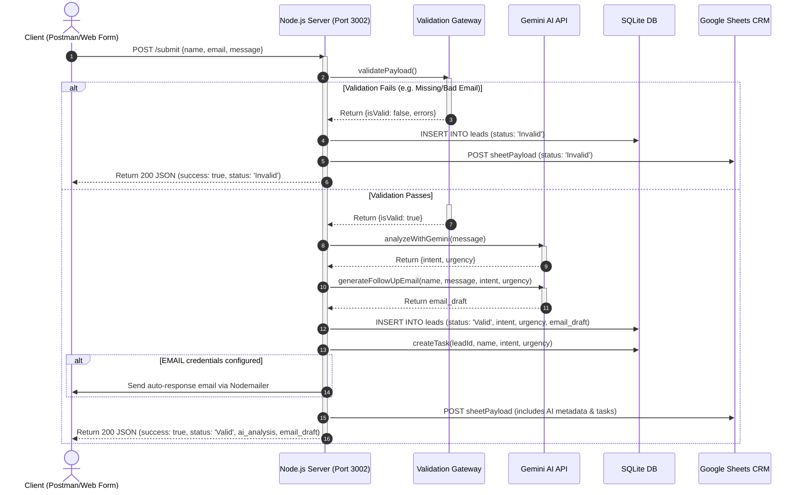

# Final Project – Intelligent CRM Pipeline: Academic Architecture Report

This report outlines the design, architecture, validation logic, AI prompt strategies, and database schemas of the **Node.js CRM API Server**. The implementation fulfills the **Final Project – Full Workflow** requirements.

---

## 🎯 1. Required Architecture & Full Workflow
The system strictly follows the required end-to-end intelligent pipeline:
**`Trigger (form/webhook) → Validation → AI Classification → AI Email Draft → Save to CRM/Sheets → Create Email or Task`**

1. **Trigger (`POST /submit`):** The server receives JSON lead payloads (`{name, email, message}`).
2. **Validation Gateway:** A synchronous validation function checks for missing fields and verifies email formats. If invalid, the flow bypasses AI processing to save API costs.
3. **AI Classification:** Validated payloads are sent to Google's **Gemini 2.5 Flash** model to determine category (`intent`) and `urgency`.
4. **AI Follow-up Email Draft:** The AI generates a personalized follow-up response tailored to the lead's inquiry, category, and urgency level.
5. **SQLite & CRM Persistence:** The system performs dual-table storage (`leads` and `tasks` tables) and replicates all fields + metadata to **Google Sheets**.
6. **Email Transporter / Task Creator:** If mail credentials are provided, the system automatically sends the generated draft via Gmail/Nodemailer; otherwise, it records the draft and logs the task for manual follow-up.

### UML Sequence Diagram (Sıralı Etkileşim Diyagramı)


---

## 🎯 2. Deliverable Check: Validation Logic & Rules
The server implements strict validation rules within `validatePayload()` in `final_server.js` before executing any AI actions:

- **Missing Field Validation:** Enforces that `name`, `email`, and `message` must be present and not consist solely of whitespace (`.trim() === ''`).
- **Format Check (Regex Email Validation):** Validates email structure using the standard regular expression:
  ```javascript
  const emailRegex = /^[^\s@]+@[^\s@]+\.[^\s@]+$/;
  ```
- **Bypass and Marking Bad Data:** 
  - If validation fails, `leadStatus` is explicitly marked as `"Invalid"`.
  - The AI analysis and email drafting steps are bypassed.
  - The malformed lead is committed to SQLite and Google Sheets with its corresponding validation errors documented.

---

## 🎯 3. Deliverable Check: AI Prompt Strategy & Documentation

The system leverages **Gemini 2.5 Flash** using a highly strict **Zero-Shot Prompting Strategy** to guarantee clean outputs.

### A. Classification Prompt
This prompt classifies the message and enforces JSON formatting to allow seamless parsing in Node.js:
```text
Analyze the following customer message.
Determine the 'intent' (e.g., Sales, Support, Inquiry, Feedback, Partnership) and the 'urgency' (Low, Medium, High).
Return ONLY a valid JSON object with the keys "intent" and "urgency". No markdown, no explanation.

Message: "{message}"
```

### B. Personalized Email Draft Prompt
This prompt generates follow-up emails, dynamically mapping tone to urgency levels:
- **High Urgency:** urgent and empathetic
- **Medium Urgency:** professional and friendly
- **Low Urgency:** casual and warm

```text
You are a professional customer success representative.
Write a personalized follow-up email to a lead based on the information below.

Lead Name: {name}
Lead Message: "{message}"
Detected Intent: {intent}
Detected Urgency: {urgency}
Tone: {toneGuide[urgency]}

Rules:
- Start with "Subject:" on the first line
- Then a blank line, then "Body:"
- The email body should be 3-5 sentences max
- Address the lead by first name
- Match the tone to the urgency level
- Do NOT make promises about pricing or guarantees
- End with a professional sign-off from "The Team"

Return only the Subject and Body. No extra explanation.
```

---

## 🎯 4. Deliverable Check: SQLite & Sheets Data Schema

The SQLite database (`database_final.sqlite`) utilizes a relational schema to cleanly separate customer records from operational tasks.

### A. SQLite Table Schemas

#### 1. `leads` Table (Customer Records & AI Metadata)
Stores original inputs, AI classification results, and the generated response draft.
```sql
CREATE TABLE IF NOT EXISTS leads (
  id INTEGER PRIMARY KEY AUTOINCREMENT,
  name TEXT NOT NULL,
  email TEXT NOT NULL,
  message TEXT NOT NULL,
  status TEXT NOT NULL,          -- 'Valid' or 'Invalid'
  intent TEXT,                   -- Sales, Support, Feedback, etc.
  urgency TEXT,                  -- Low, Medium, High
  email_draft TEXT,              -- AI-generated email subject and body
  created_at DATETIME DEFAULT CURRENT_TIMESTAMP
);
```

#### 2. `tasks` Table (Actionable Tasks)
Stores automatic tasks created for valid leads, linking back to the parent lead.
```sql
CREATE TABLE IF NOT EXISTS tasks (
  id INTEGER PRIMARY KEY AUTOINCREMENT,
  lead_id INTEGER NOT NULL,
  title TEXT NOT NULL,
  description TEXT,
  priority TEXT NOT NULL,        -- 'high', 'medium', 'low'
  status TEXT DEFAULT 'pending', -- 'pending', 'completed'
  created_at DATETIME DEFAULT CURRENT_TIMESTAMP,
  FOREIGN KEY(lead_id) REFERENCES leads(id)
);
```

### B. Google Sheets Schema
When `GOOGLE_SCRIPT_URL` is set, the server replicates the full record plus operational metadata. The sheet matches the following columns:
1. `contact_name`
2. `contact_email`
3. `inquiry_message`
4. `captured_at`
5. `lead_status`
6. `intent`
7. `urgency`
8. `errors` (validation error details)
9. `email_draft`
10. `email_sent` (string `"true"` or `"false"`)
11. `task_created` (linked task title)

---

## 🎯 5. API Endpoints & Verification Plan

The server hosts the following HTTP endpoints on **Port 3002**:

| Method | Path | Input / Behavior | Output |
|---|---|---|---|
| `POST` | `/submit` | Accepts `{name, email, message}`. Processes through validation, AI classification, email drafting, task creation, and email sending. | Returns complete lead processing summary JSON. |
| `GET` | `/leads` | Queries `leads` table ordered by newest first. | List of captured leads. |
| `GET` | `/tasks` | Queries `tasks` table ordered by newest first. | List of follow-up tasks. |

### Verification Scenarios (Tested using Postman)
1. **Invalid Input Test Case (Bypass check):** Sending a blank email or missing name explicitly triggers validation errors, sets status to `Invalid`, skips Gemini AI pipelines, saves to SQLite with validation errors, and logs a descriptive response.
2. **Valid Input Test Case (Full Pipeline):** A valid inquiry (e.g., about enterprise pricing) undergoes AI classification (`intent: "Sales"`, `urgency: "High"`), triggers a personalized follow-up draft, registers a task with `priority: "high"` in SQLite, automatically sends an email (if SMTP is configured), and replicates the full data bundle to Google Sheets.

---

## 🎯 6. Step-by-Step Live Walkthrough & Workflow Execution
For live presentations, the workflow execution follows these exact sequential steps to demonstrate end-to-end processing:

1. **Step 1: Input Trigger (POST /submit)** - The entry point receives raw JSON containing `{name, email, message}` from the client or webhook trigger.
2. **Step 2: Validation Gateway (Regex Email & Empty Checks)** - Runs synchronous validation. If inputs fail (e.g., missing name or malformed email), the system flags status as `Invalid`, records the errors, and immediately routes to the database—skipping the AI classification step entirely to prevent API waste.
3. **Step 3: AI Classification (Gemini 2.5 Flash)** - Valid leads are sent to the AI model using a strict Zero-Shot prompt. The model returns a structured JSON categorizing the lead's business intent (Sales, Support, Feedback, etc.) and urgency level (Low, Medium, High).
4. **Step 4: AI Follow-Up Email Draft (Gemini 2.5 Flash)** - The AI drafts a personalized 3-5 sentence follow-up email, dynamically adjusting the communication tone to match the lead's urgency (e.g., urgent/empathetic for High urgency, casual/warm for Low urgency).
5. **Step 5: Database Persistence (Dual-Table SQLite)** - Commits the lead details to the `leads` table and automatically creates a linked task in the `tasks` table with calculated priority levels.
6. **Step 6: Actions & Synchronization (Nodemailer & Google Sheets)** - Dispatches the follow-up email to the customer (if SMTP credentials exist) and replicates the full 12-column record to Google Sheets, mapping column C to `organization` and column D to `inquiry_message`.
