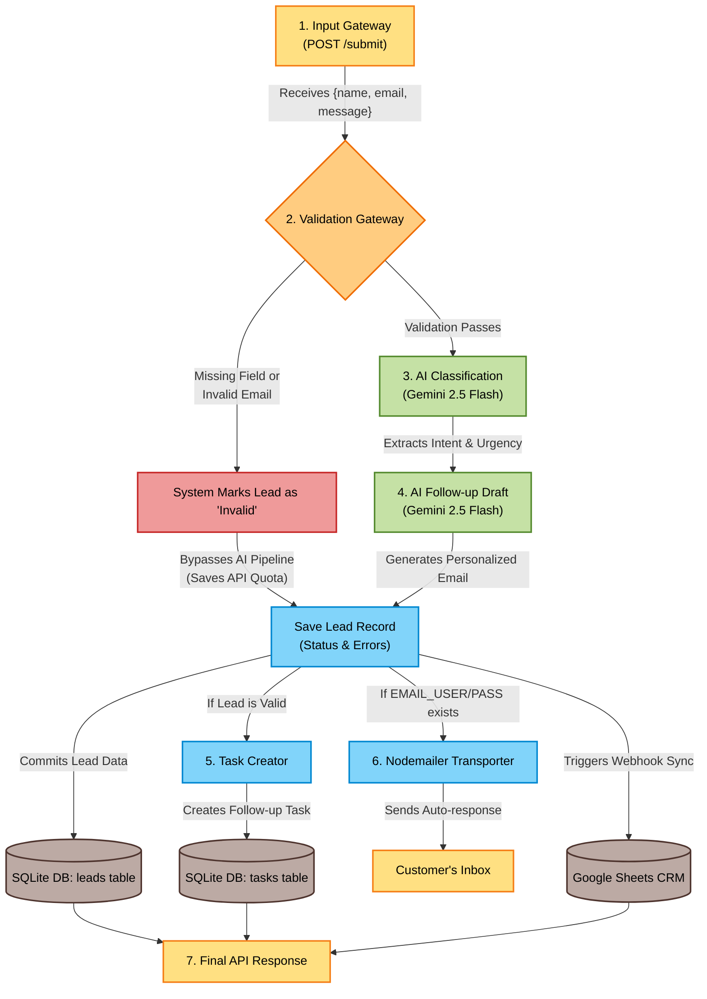

# Final Project & HW3 – Intelligent Lead Capture CRM Pipeline

This repository contains the complete implementation for **HW3** and the **Final Project**. It upgrades a basic webhook receiver into an intelligent, validation-aware CRM data pipeline utilizing the Google Gemini 2.5 Flash API, local SQLite relational storage, automatic follow-up email dispatch, and Google Sheets integration.

---

## 🎯 Required Architecture & Workflow

The pipeline strictly fulfills the following workflow:
**`Input ({name, email, message}) → Validation (Email/Format Check) → AI Classification (Intent/Urgency) → AI Email Draft → Save to SQLite & Google Sheets → Create Email or Task`**

*Note: You can double-click the `hw3_diagram.html` file in your folder to view the flowchart in full color in your web browser!*



---

## 🎯 Environment Variables (`.env`)

Create a `.env` file in the root of the project:

```env
GEMINI_API_KEY=<your-google-gemini-api-key>
GOOGLE_SCRIPT_URL=<your-google-apps-script-web-app-url>
EMAIL_USER=<your-gmail-address>                  # Optional - for actual auto-responses
EMAIL_PASS=<your-gmail-app-password>             # Optional - Gmail App Password
```

> **Note:** If `EMAIL_USER` and `EMAIL_PASS` are omitted, the pipeline still generates the personalized email draft, saves it to SQLite, and logs a task—it simply skips the actual email dispatch without throwing any errors.

---

## 🎯 Project Structure & Deliverables

- **`hw3_server.js`**: The main Node.js application running on **Port 3002** (isolated to prevent port conflicts).
- **`HW3_Report.md`**: Academic report outlining AI prompt strategies, validation rules, and relational schemas.
- **`hw3_workflow_uml.md`**: Mermaid markup file documenting the workflow diagram.
- **`hw3_diagram.html`**: Interactive workflow flowchart.
- **`database_hw3.sqlite`**: Local relational SQLite database.
- **`package.json`**: Lists Node.js dependencies (`sqlite3`, `dotenv`, `nodemailer`).

---

## 🎯 Endpoints Overview

| Method | Endpoint | Description |
|---|---|---|
| `POST` | `/submit` | Main pipeline. Receives, validates, classifies, drafts, and saves leads. |
| `GET` | `/leads` | Displays all recorded leads from SQLite. |
| `GET` | `/tasks` | Displays all follow-up tasks from SQLite. |

---

## 🎯 Step-by-Step Running & Testing

### 1. Install Dependencies
Open a terminal in the project directory and run:
```bash
npm install
```

### 2. Start the Server
```bash
node hw3_server.js
```
*(Server will listen on port 3002).*

### 3. Test Cases (Postman or curl)

#### 🔴 Test Case 1: Invalid Input (Bypass check)
Paste this payload in a `POST http://localhost:3002/submit` request:
```json
{
  "name": "Ahmet Yilmaz",
  "email": "ahmet-hatali-mail",
  "message": "Sisteme giriş yapamıyorum."
}
```
**Expected Result:** The system flags the invalid email, marks `status: "Invalid"`, skips the Gemini AI step entirely, saves to SQLite with validation errors, and returns a summary JSON.

#### 🟢 Test Case 2: Valid Input (AI Pipeline & Automation)
Send this payload:
```json
{
  "name": "Busra Demir",
  "email": "busra@example.com",
  "message": "Şirketimiz için Enterprise paketinizle ilgileniyoruz, acil olarak fiyat teklifi alabilir miyiz?"
}
```
**Expected Result:** 
- Email passes validation.
- Gemini AI classifies as `intent: "Sales"` and `urgency: "High"`.
- Gemini AI generates a personalized follow-up email draft.
- SQLite saves the lead record.
- A task with high priority is automatically logged in the `tasks` table.
- Email is automatically dispatched via Nodemailer (if credentials are set).
- Full dataset is synced to Google Sheets.

---

## 🎯 Live Presentation & Step-by-Step Walkthrough Guide

Use this structure to walk through your workflow live during evaluation:

1. **Giriş (Intro):** Explain the objective: Building an intelligent CRM gateway that captures, validates, and processes incoming leads with Gemini AI and syncs them to bulut CRM (Google Sheets).
2. **Step 1: Input Trigger:** Send a webhook request (`POST /submit`).
3. **Step 2: Validation Firewall:** Demonstrate the bypass check by sending an invalid email. Point out that the system sets `status: "Invalid"` and intentionally skips Gemini AI processing to save budget.
4. **Step 3: AI Sınıflandırma:** Send a valid inquiry. Point out that Gemini AI successfully extracts `intent` and `urgency` on the fly.
5. **Step 4: AI E-posta Taslağı:** Show the custom 3-5 sentence follow-up email draft, explaining how the AI tone dynamically changes based on the urgency level (e.g. urgent/empathetic for High priority).
6. **Step 6: CRM / Database Persistence:** Show the data committed locally in the SQLite `leads` and `tasks` tables, and show the automatic synchronization to Google Sheets under the exact requested column layout (C = `organization`, D = `inquiry_message`).
