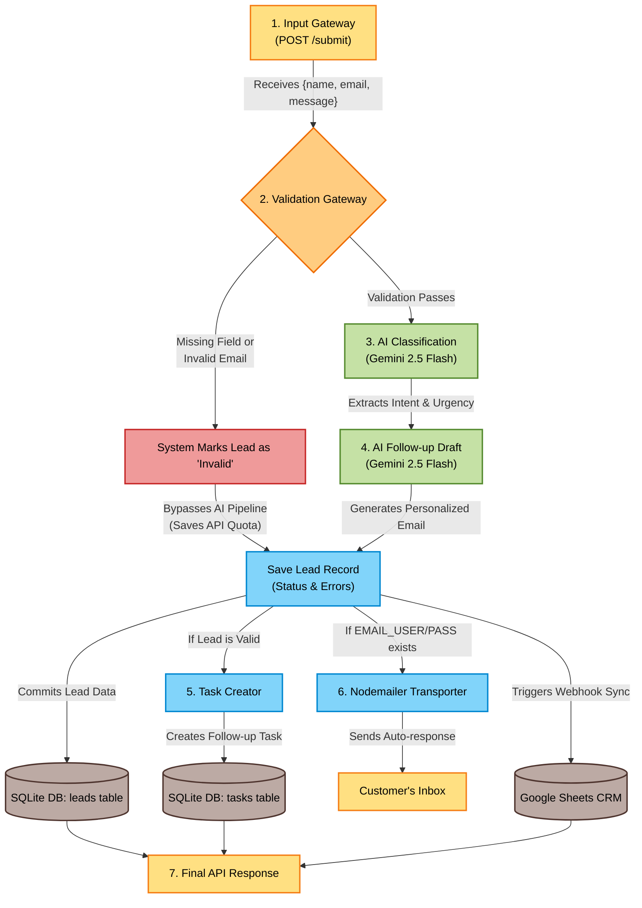
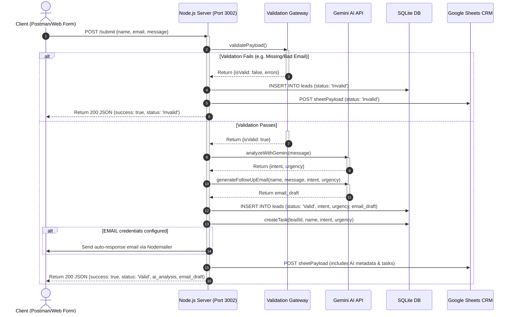

# Final Project Workflow & UML Diagrams (End-to-End CRM Pipeline)

This document contains two visual representations of our intelligent webhook-to-CRM pipeline:
1. **Flowchart (İş Akış Şeması):** Illustrates the high-level decision routing.
2. **UML Sequence Diagram (UML Sıralı Etkileşim Diyagramı):** Chronologically details the API requests, validation logic, Gemini AI processing, and persistence layers.

---

## 📊 1. High-Level Flowchart
Illustrates how validation failure or success determines the workflow path.

---

## 🎯 2. UML Sequence Diagram (Sıralı Etkileşim Diyagramı)
Chronologically maps out how the Node.js server acts as the central coordinator (orchestrator) between the client, local SQLite tables, Gemini AI, and external Google Sheets.

