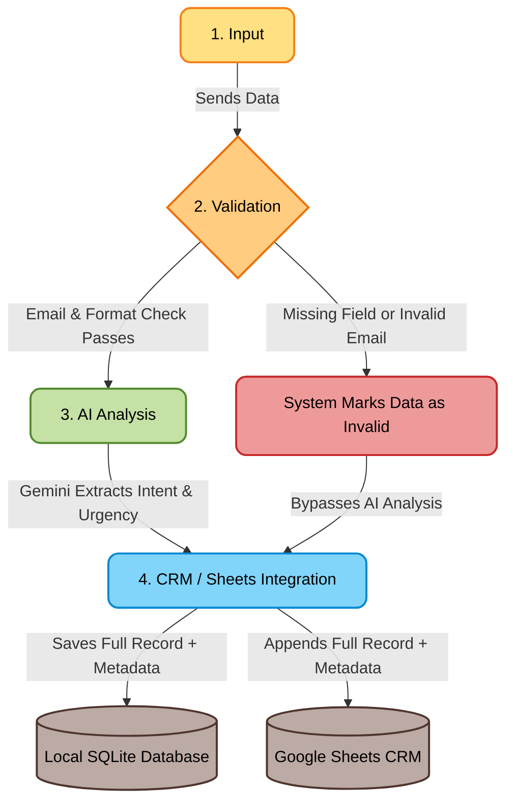

# HW3 Workflow Architecture (Validation & AI Processing)

```mermaid
flowchart TD
    classDef trigger fill:#FFE082,stroke:#F57F17,stroke-width:2px,color:#000000,rx:10,ry:10
    classDef decision fill:#FFCC80,stroke:#EF6C00,stroke-width:2px,color:#000000,rx:10,ry:10
    classDef ai fill:#C5E1A5,stroke:#558B2F,stroke-width:2px,color:#000000,rx:10,ry:10
    classDef server fill:#81D4FA,stroke:#0288D1,stroke-width:2px,color:#000000,rx:10,ry:10
    classDef storage fill:#BCAAA4,stroke:#4E342E,stroke-width:2px,color:#000000,rx:10,ry:10
    classDef invalid fill:#EF9A9A,stroke:#C62828,stroke-width:2px,color:#000000,rx:10,ry:10

    A["1. Input"]:::trigger -->|"Sends Data"| B{"2. Validation"}:::decision
    
    B -->|"Email & Format Check Passes"| D["3. AI Analysis"]:::ai
    D -->|"Gemini Extracts Intent & Urgency"| E["4. CRM / Sheets Integration"]:::server
    
    B -->|"Missing Field or Invalid Email"| C["System Marks Data as Invalid"]:::invalid
    C -->|"Bypasses AI Analysis"| E
    
    E -->|"Saves Full Record + Metadata"| F[("Local SQLite Database")]:::storage
    E -->|"Appends Full Record + Metadata"| G[("Google Sheets CRM")]:::storage
```
